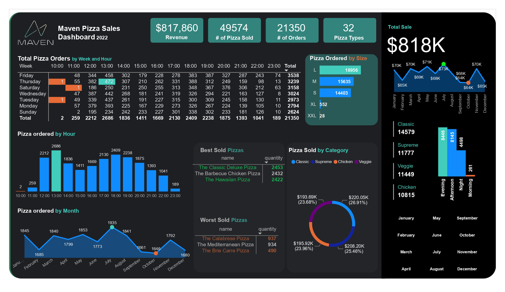
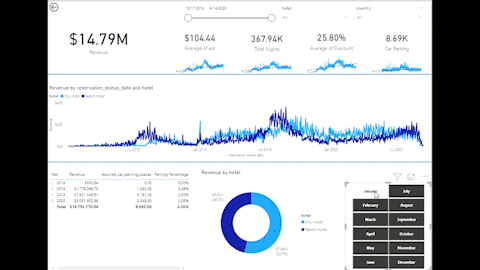
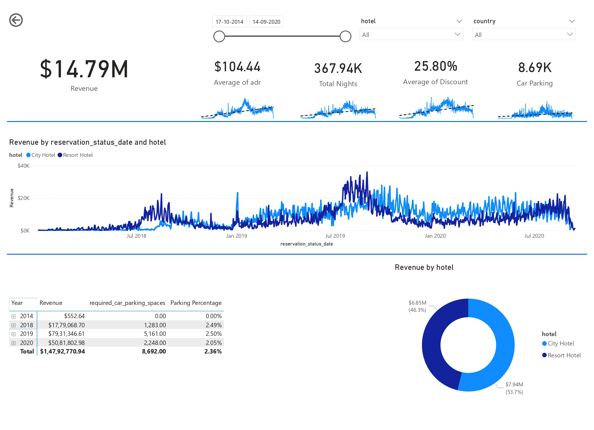

# AbdulMugni PowerBI Developer Portfolio

<iframe title="finalreport" width="600" height="373.5" src="https://app.powerbi.com/view?r=eyJrIjoiZTA3NTExOGQtYTk5NS00OTM4LWJlYjItNjI3YmM5MjJkNTZjIiwidCI6IjBkZTRmOTJjLTY0NmItNGU5NS1iYTRmLTYwOTJiYWNjYjQ2MSJ9" frameborder="0" allowFullScreen="true"></iframe>

# 1.	Maven Pizza Analysis

### Used Tools

* 1- Business requirement Document (BRD)
* 2- Data Gathering
* 3- Data Cleaning/Transformation
* 4- Data modelling
* 5- UI(Power View Reports)
* 6- DAX functions
* 7- Enhance UI
* 8- Row Level Security(RLS)

* Power Query (Advancce Editor, Custom Columns, Transformation)
* Power Pivot (Data Model, Star Schema)
* DAX (Calculated Column, Measures)
* R (Pull UNZIP file from Web)
* Charts (Bar chart, Column Chart, Donught Chart, Matrics, Cards etc)

**Summary** : The Maven Pizza Analysis report is a project developed to analyze customer satisfaction and purchasing trends at a pizza restaurant. 
The report includes data on customer demographics, menu item popularity, and feedback on service and atmosphere. 
The findings of the report were used to make recommendations for improving the restaurant's overall performance. 
The report has also been used to identify potential areas for future expansion and to help create a more personalized and enjoyable experience for customers. 
Overall the project aims to increase customer satisfaction and sales by utilizing data and customer feedback to improve the operations and service of the pizza restaurant.

### Requirements

*	What days and times do we tend to be busiest?
*	How many pizzas are we making during peak periods?
*	What are our best and worst-selling pizzas?
*	What's our average order value?

### Solution

*	Build Dataset
*	Develop the Model
*	Import Dataset in PowerBi
*	Visualize
*	Summarize findings 

### Steps

*	Import CSV file into the PowerBi using the CSV import option/Pull the Zip file directly from website using R language.
*	Create a model and clean the data with a Power query
*	Write queries for the desired result
*	Write DAX query for complex calculation
*	Create measures and Calculated column
*	Visualize data on canvas using visualization chats
*	Create RLS

# 2. Hotel Revenue Report

### Used Tools

* 1- Business requirement Document (BRD)
* 2- Data Gathering
* 3- Data Cleaning/Transformation
* 4- Data modelling
* 5- UI(Power View Reports)
* 6- DAX functions
* 7- Enhance UI

* Power Query (Advancce Editor, Custom Columns, Transformation)
* Power Pivot (Data Model, Star Schema)
* DAX (Calculated Column, Measures)
* Microsoft SQL Server (Direct Query mode)
* Charts (Bar chart, Column Chart, Donught Chart, Matrics, Cards etc)

**Summary** : The hotel revenue analysis determined that the hotel's revenue has been growing year over year. 
However, it is important to note that other factors such as changes in occupancy rates and room prices also play a role in revenue growth.
In terms of the parking lot size, the analysis did not specifically investigate the impact of parking on revenue. However, it would be important to consider customer feedback and satisfaction with the current parking situation, as well as any potential increase in demand for parking before making a decision to expand the parking lot.
Trends in the data revealed that occupancy rates and room prices were the primary drivers of revenue.
It's also observed that the revenue increases during holidays, festivals and seasons.

### Requirements

*	Is our hotel revenue growing by year?
*	Should we increase our parking lot size?
* What trends can we see in the data?

### Solution

*	Build Database
*	Write the SQL query
*	Connect PowerBi to the Database
*	Visualize
*	Summarize findings

### Steps

*	Import CSV file into the MSSM
*	Create a model and clean the data
*	Write queries for the desired result
*	Import query in PowerBi by connecting SQL server option
*	Create measures and Calculated column
*	Visualize data on canvas using visualization charts

